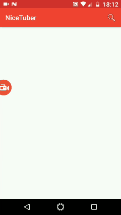

# NiceTuber an Android Native Application

This App was created with the objective of explore new features of Android development.

* VIPER Architecture
* Dagger 2.11
* RxJava 2 & RxAndroid 2
* Retrofit 2
* Glide
* GSON
* ConstraintLayout
* Youtube API
* Data Binding (for Java version)

**Atention: To build project, it's necessary to replace YOUTUBE_API_KEY on ´build.gradle´ for a valide key.**

>This repository has more two branchs, Kotlin and Java version.

#### Demo

